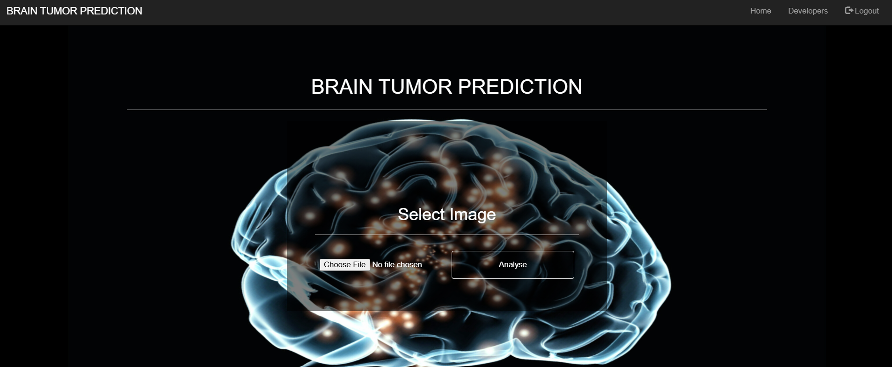
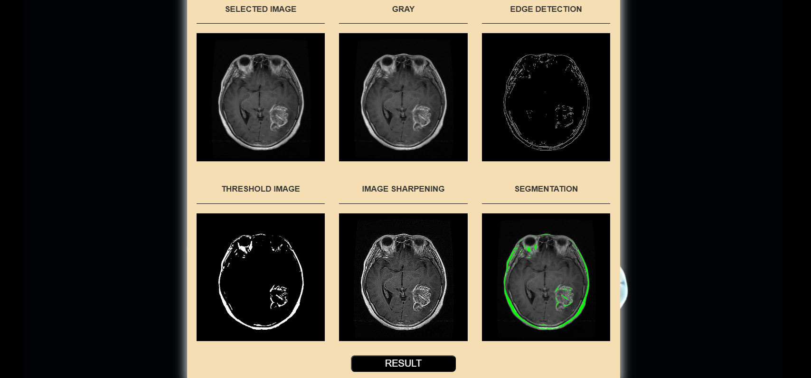
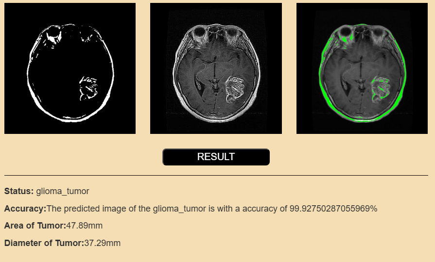

# Brain Tumor Detection Using Machine Learning

This project leverages Machine Learning and Convolutional Neural Networks (CNN) to detect brain tumors in MRI images. The system is designed to identify the presence of a tumor, especially in its early stages, using advanced image processing techniques.

## Features

- **MRI Image Analysis:** Accepts an MRI image as input.
- **Tumor Detection:** Predicts whether the MRI shows the presence of a tumor.
- **Early Detection:** Focused on identifying tumors at an early stage.
- **User-Friendly:** A Flask-based web interface for easy interaction.

## Technologies Used

- **Programming Language:** Python
- **Machine Learning Framework:** Scikit-learn
- **Deep Learning:** Convolutional Neural Networks (CNN)
- **Web Framework:** Flask
- **Dataset:** Brain tumor dataset (ensure appropriate dataset preprocessing).

requirements.txt` content:

```
Flask
numpy
pandas
scikit-learn
matplotlib
opencv-python
tensorflow
keras
```
## How It Works

1. **Data Preparation:**
   - Load and preprocess the MRI images.
   - Split the data into training and testing sets.

2. **Model Training:**
   - Train a Convolutional Neural Network (CNN) using the brain tumor dataset.
   - Evaluate the model's performance using metrics like accuracy and loss.

3. **Tumor Detection:**
   - Input an MRI image through the web interface.
   - The system predicts and displays whether a tumor is present.

## Example Workflow

1. Upload an MRI image using the web interface.
2. Click on the "Predict" button.
3. View the result (e.g., "Tumor Detected" or "No Tumor Detected").

## Results

- **Model Accuracy:** Add details of model accuracy achieved during testing.
- **Sample Outputs:** Include a few example predictions.

## Screenshots

Add screenshots of your web interface, sample input images, and output results here.

Input an MRI image 

View the result


## Future Enhancements

- Improve the model by using a larger dataset.
- Enhance the web interface for better user experience.
- Add support for additional medical imaging formats.
